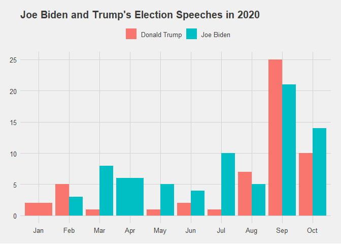

<!-- README.md is generated from README.Rmd. Please edit that file -->

# us2020election

<!-- badges: start -->

[](https://www.tidyverse.org/lifecycle/#experimental)
[](https://CRAN.R-project.org/package=instaloadeR)
<!-- badges: end --><!-- badges: end -->

The goal of us2020election is to provide a tidy way to access to the
transcripts of speeches given by various US politicians in the context
of the 2020 US Presidential Election. Transcripts have been scraped from
[rev.com](https://www.rev.com/blog/transcript-category/2020-election-transcripts).
Some other information, such as location and type of speech, have been
manually added to the dataset. The dataset has the following columns:

`speaker`: Who gave the speech

`title`: a title or a description of speech

`text`: the transcript of the speech

`location`: the location or the platform where the speech was give

`type`: type of speech (e.g., campaign speech, interview or debate)

## Installation

You can install the released version of `us2020election`with:

``` r
install.packages("remotes")
remotes::install_github("mcnakhaee/us2020election")
```

## Example

This is a basic example which shows you how to use the datase:

``` r
library(us2020election)
library(tidyverse)
library(ggthemes)
## basic example code
```

``` r
glimpse(us_election_speeches)
#> Rows: 269
#> Columns: 6
#> $ speaker  <chr> "David Perdue", "Joe Biden", "Donald Trump", "Joe Biden", ...
#> $ title    <chr> "Georgia Sen. David Perdue Speech Transcript at Trump Rall...
#> $ text     <chr> "David Perdue: (00:01)\nHow great is it to be back in Maco...
#> $ date     <chr> "Oct 16, 2020", "Oct 16, 2020", "Oct 16, 2020", "Oct 15, 2...
#> $ location <chr> "Macon, Georgia", "Southfield ,Michigan", "Fort Myers, Flo...
#> $ type     <chr> "Campaign Speech", "Campaign Speech", "Campaign Speech", "...
```

``` r
us_election_speeches %>% 
  mutate(date = lubridate::mdy(date),
         month = lubridate::month(date,abbr = T,label = T)) %>% 
  separate_rows(speaker,sep = ', ') %>% 
  count(speaker,month,sort = TRUE) %>% 
  filter( speaker %in% c('Joe Biden', 'Donald Trump')) %>% 
  ggplot(aes(x = as.factor(month),y = n,fill = speaker)) +
  geom_col(position = 'dodge') +
labs(title = "Joe Biden and Trump's Election Speeches in 2020",fill = '') +
  theme_fivethirtyeight() +
  theme(plot.title = element_text(size = 15),
        legend.position = 'top')
```


